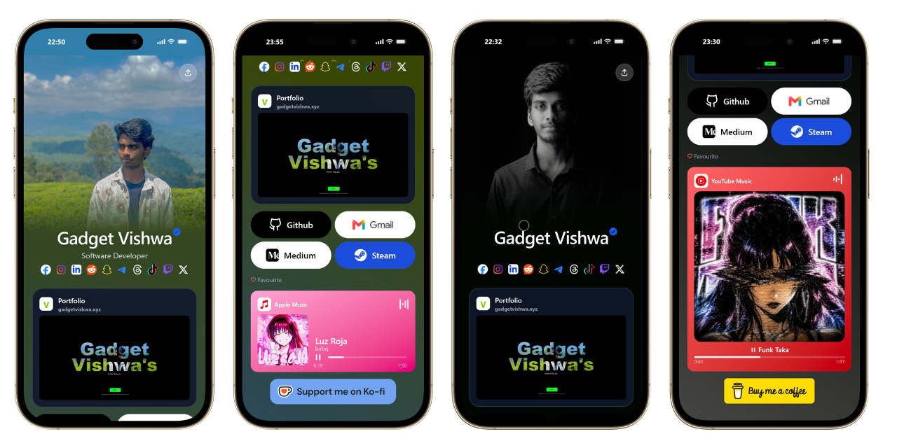

# Linktree

<p align="center">
  
</p>

A personal, self-hosted [Linktree](https://linktr.ee)-style bio-link page. Built with **React 19 + Vite**, **Tailwind CSS v4**, and **GSAP**. Every link, icon, and label on the page is data-driven — you customize the whole site by editing a single file, no JSX required.

## Tech stack

- React 19 + Vite
- Tailwind CSS v4
- GSAP / `motion` for animation
- `react-icons` for all platform icons

## Getting started

```bash
cd linktree
npm install
npm run dev      # start local dev server
npm run build     # production build → dist/
```

## Customization — `src/data/Links.js`

This is the only file most people ever need to touch. It's the single source of truth for the profile info and every link on the page — the header, the social row, the featured card, the pill-button grid, the music card, and the support button. Change something here and it updates everywhere automatically; no hunting through JSX.

For Example to customize Hero Section:
```js
// Profile info at the top of the page
export const profile = {
    name: "Tony Stark",
    image: "https://media.gadgetvishwa.xyz/images/profile.png",
    color:1, // 0 -1  color theme
    titles: ["Iron Man", "Unlimited AI API Guy", "Suit Builder", "Pilot"],
};
```
Each section below is exported separately from `Links.js`.

### `profile`

Header info — name, photo, and the rotating job-title text.

| Field | Type | Required | Description |
|---|---|---| ---|
| `name` | string | ✅ | Displayed name, animated in with a text-reveal effect. |
| `image` | string | ✅ | Path to the profile photo. Local files go in `public/` (e.g. `/pic1.png`); you can also point this at a full URL. |
| `color` | number (`0`–`1`) | ✅ | Reserved for tuning how strongly the extracted/vibrant color from the photo tints the page. `0` = no tint, `1` = full strength. |
| `titles` | string[] | ✅ | List of job titles/roles that rotate under the name. Add or remove as many as you like. |

### `socialLinks`

The row of social icons under the profile header. It's an array — add, remove, or reorder entries freely; the icon row renders in array order.

| Field | Type | Required | Description |
|---|---|---|---|
| `platform` | string | ✅ | Internal id for the platform (lowercase, e.g. `"instagram"`). Used as the React key. |
| `name` | string | ✅ | Human-readable label (used for accessibility/alt text). |
| `link` | string | ✅ | The URL the icon opens. |
| `available` | boolean | ✅ | **Set this to `false` to hide the icon without deleting the entry.** This is how you turn platforms on/off — e.g. you don't use Snapchat anymore but might come back to it later. |
| `icon` | component | ✅ | A `react-icons` component, e.g. `FaInstagram` from `react-icons/fa6`. Import it at the top of the file. |
| `wrapperClass` | string | optional | Tailwind classes for the icon's background pill (e.g. `"bg-blue-500 rounded-full"`). Omit for a bare icon with no background. |
| `iconClass` | string | optional | Tailwind classes applied to the icon itself (color, padding, gradient class, etc). |
| `custom` | boolean | optional | Set on `tiktok` to render its special 3-layer glitch icon instead of a single flat icon. Only needed for icons that require bespoke rendering — most platforms won't use this. |

**Adding a new platform:** import its icon from `react-icons`, then add a new object to the array with a unique `platform` id. That's it — no other file needs to change.

```js
import { FaSpotify } from "react-icons/fa6";

{
  platform: "spotify-profile",
  name: "Spotify",
  link: "https://open.spotify.com/user/yourname",
  available: true,
  icon: FaSpotify,
  iconClass: "text-green-500",
}
```

### `featuredLink`

The large card near the top of the link list (a portfolio/website preview with an image). There's only one — it's a single object, not an array.

| Field | Type | Description |
|---|---|---|
| `platform` | string | Internal id, not currently used for icon lookup — free to leave as `"portfolio"`. |
| `link` | string | URL the card opens. |
| `available` | boolean | Set `false` to hide the card entirely. |
| `label` | string | Card title. |
| `subtitle` | string | Small text under the title (e.g. the bare domain name). |
| `preview` | string | URL of the preview image shown inside the card. |

### `quickLinks`

The grid of pill buttons below the featured card (GitHub, Gmail, Medium, Steam, etc). Array — add/remove/reorder freely.

| Field | Type | Description |
|---|---|---|
| `platform` | string | Label/id for the button. Also used as the React key, so keep it unique. |
| `link` | string | URL the button opens (supports `mailto:` links too, see the Gmail entry). |
| `icon` | component | A `react-icons` component. Use this **or** `image`, not both. |
| `image` | string | Use instead of `icon` when you want a logo image (like the Gmail button) rather than a react-icons glyph. |
| `className` | string | Tailwind classes for the button's background/text color. |

> **Note:** unlike `socialLinks`, these entries don't currently have an `available` flag — to hide one, remove it from the array (or add `available: true/false` yourself and filter on it if you want the same toggle behavior here too).

### `musicLink`

The "now playing" card. Single object — supports Apple Music, Spotify, YouTube Music, SoundCloud, and Tidal out of the box.

| Field | Type | Description |
|---|---|---|
| `theme` | number (`1`–`2`) | Which visual style/layout variant of the card to use. |
| `platform` | string | One of `"appleMusic"`, `"spotify"`, `"ytmusic"`, `"soundcloud"`, `"tidal"`. Controls the card's icon and brand color. |
| `link` | string | URL to the track/album/playlist. |
| `available` | boolean | Set `false` to hide the music card entirely. |
| `title` | string | Track title. |
| `artist` | string | Artist name. |
| `duration` | number | Track length in seconds — used to size/animate the progress or visualizer. |
| `cover` | string | Album art URL shown in the card. |

**Switching platforms:** just change `platform` — e.g. set it to `"spotify"` and update `link`/`title`/`artist`/`cover` to match. No component code needs to change.

### `supportLink`

The donation button pinned near the bottom of the page. Single object.

| Field | Type | Description |
|---|---|---|
| `platform` | string | One of `"paypal"`, `"buymeacoffee"`, `"kofi"` — controls the button's icon/branding. |
| `link` | string | Your donation page URL. |
| `available` | boolean | Set `false` to hide the button entirely (e.g. if you don't accept donations). |

---

## Customization — `index.html` (SEO & metadata)

Everything about how the page appears in search results, browser tabs, and link-preview cards (iMessage, WhatsApp, Discord, X/Twitter, Slack, etc.) lives in `index.html`, not in React. Update this whenever you fork the project for yourself — leaving the original owner's info here means search engines and share previews will show *their* name/site, not yours.

| Tag | What it controls |
|---|---|
| `<title>` | Text shown in the browser tab and in Google search results. |
| `<meta name="description">` | The one-line summary Google shows under your title in search results. |
| `<meta name="keywords">` | Comma-separated topic words. Largely ignored by modern search engines, but harmless to keep accurate. |
| `<meta name="author">` | Page author, for metadata purposes only — not shown to visitors. |
| `<meta name="theme-color">` | Color of the browser chrome/status bar on mobile when the site is open (Android Chrome, iOS Safari). Set it to match your gradient/brand color. |
| `<link rel="canonical">` | The "official" URL for this page. Set it to your actual deployed domain — prevents duplicate-content issues if the site is ever reachable at more than one URL. |
| `<link rel="icon">` | Favicon shown in browser tabs. Points at `/logo.svg` in `public/` by default — swap that file or change the path. |
| `og:type`, `og:url`, `og:title`, `og:description`, `og:image`, `og:site_name` | **Open Graph** tags — control the preview card shown when your link is pasted into WhatsApp, iMessage, Discord, Slack, LinkedIn, Facebook, etc. `og:image` should be a full URL to a real image (ideally 1200×630px). |
| `twitter:card`, `twitter:title`, `twitter:description`, `twitter:image` | Same idea, specifically for how the link renders on X/Twitter. `twitter:card` should stay `summary_large_image` for a big preview image. |
| `apple-mobile-web-app-title` | Name shown under the icon if someone adds this page to their iOS home screen. |
| `apple-mobile-web-app-capable` | Set to `yes` to let the page run full-screen (no Safari address bar) when launched from the home screen. |

**Checklist when forking:**

1. Replace every occurrence of the name/handle in `<title>`, `<meta name="description">`, `og:title`, `og:description`, `twitter:title`, `twitter:description`, and `apple-mobile-web-app-title`.
2. Update `<link rel="canonical">` and `og:url` to your real deployed domain.
3. Replace `og:image` / `twitter:image` with a URL to your own preview image (screenshot of the page works well).
4. Swap `public/logo.svg` for your own favicon, or update `<link rel="icon">` to point elsewhere.
5. Optionally adjust `theme-color` to match your gradient/brand color.

Note: `og:image` and `twitter:image` must be **absolute URLs** (e.g. `https://yoursite.com/preview.png`), not relative paths — most platforms that generate link previews (WhatsApp, Discord, etc.) won't resolve relative image paths correctly.

---

### TL;DR for contributors

To fork this and make it your own, you only need to edit `src/data/Links.js`:

1. Swap `profile.image` for your photo (drop it in `public/`) and update `profile.name` / `profile.titles`.
2. Go through `socialLinks` and flip `available` to `false` for anything you don't use — or add new platforms by importing an icon from `react-icons` and pushing a new entry.
3. Point `featuredLink` at your own site/portfolio, or set `available: false` to remove the card.
4. Edit `quickLinks` to match the platforms you actually want buttons for.
5. Update `musicLink` with whatever you're currently listening to / promoting, and set `platform` to match the streaming service.
6. Point `supportLink` at your PayPal/Buy Me a Coffee/Ko-fi, or hide it.
7. Update `index.html` — title, meta description, canonical URL, favicon, and Open Graph/Twitter image — so search engines and link previews show your info, not the original owner's.

No other files need to change for a standard reskin.